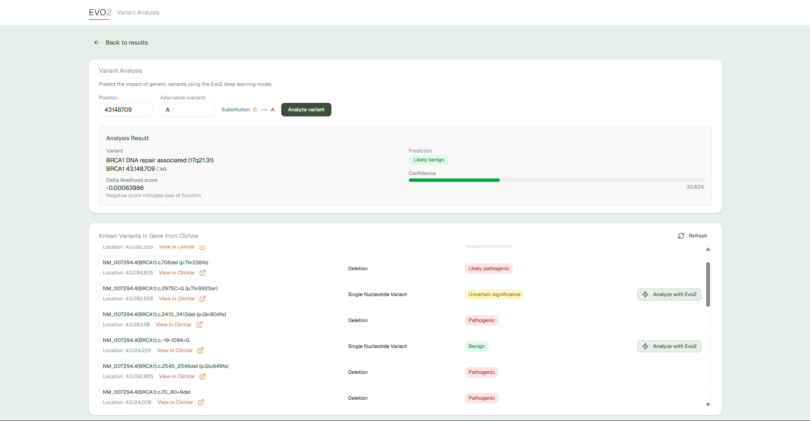

# Biotech AI Web App


<div align="center">
    
    
    
    
    
    
</div>

## Overview
In this project, I built a web app that can classify how likely specific mutations in DNA
are to cause diseases (variant effect prediction). I have deployed and use state-of-the-art Evo2 large language model,
and use it to predict the pathogenicity single nucleotide variants (SNVs). I have deployed a Python backend
on an H100 serverless GPU with Modal, exposing a FastAPI endpoint for analysis.
After deployed the backend, I built a web app around it where users can select a genome assembly,
browse its chromosomes or search for specific genes like BRCA1, and view the gene's reference genome sequence.
The user can input a mutation in the gene and predict its pathogenicity with AI, but the user can also pick from a list of
existing known variations, and compare the Evo2 prediction (pathogenic/benign) against
existing ClinVar classifications. The web app is built with Next.js, React, TypeScript, Tailwind CSS, and Shadcn UI
and is based off the T3 Stack. 

TL;DR / Simpler Version
DNA is like a long code made of A,T,G and C. Small changes (mutations) in specific parts of this code,
like in genes responsible for preventing cancer, can increase a person's risk of developing the disease.
For instance, if an 'A' appears where a 'T' should be at a particular spot, that's a mutation.
These changes can vary in how harmful they are, and I built a tool to analyze these different variations' harmfulness.

Features:
- 🧬 Evo2 model for variant effect prediction
- 🩺 Predict pathogenicity of single nucleotide variants (pathogenic/benign)
- ⚖️ Comparison view for existing ClinVar classification vs. Evo2 prediction
- 💯 Predict confidence estimation
- 🌍 Genome assembly selector (e.g., hg38)
- 🗺️ Select genes from chromosome browsing or searching (e.g., BRCA1)
- 🌐 See full reference genome sequence sequence (UCSC API)
- 🧬 Explore gene and variants data (NCBI ClinVar/E-utilities)
- 💻 Python backend deployed with Modal
- 🚀 FastAPI endpoint for variant analysis requests
- ⚡ GPU-accelerated (H100) variant scoring via Modal
- 📱 Responsive Next.js web interface
- 🎨 Modern UI with Tailwind CSS & Shadcn UI

## Evo2 Model
Check out the paper behind the model (**highly-recommended**).
- [Genome modeling and design across all domains of life with Evo 2](https://www.biorxiv.org/content/10.1101/2025.02.18.638918v1.full)
- [Evo2 github repository](https://github.com/ArcInstitute/evo2)


## Setup
Follow these steps to install and set up the project.

### Clone the repository
```bash
git clone https://github.com/conbopk/Variant-Analysis-EVO2.git
```

### Install Python
Download and install Python if not already installed. Use the link below for guidance on installation: [Python Download](https://www.python.org/downloads/)

Create a virtual environment for each folder, except frontend, with **Python 3.12**.

### Backend
Navigate to backend folder:
```bash
cd backend
```
Create venv:
```bash
python -m venv venv
venv\Scripts\Activate
```
Install dependencies:
```bash
pip install -r requirements.txt
```
Modal setup:
```bash
modal setup
```
Run on Modal:
```bash
modal run main.py
```
Deploy backend:
```bash
modal deploy main.py
```

### Frontend
Install dependencies:
```bash
cd frontend
npm i
```
Add the env variable to your .env file, like in .env.example:
```bash
NEXT_PUBLIC_ANALYZE_SINGLE_VARIANT_BASE_URL="your-api-endpoint"
```
Run:
```bash
npm run dev
```

🌐 You can also try the live web app here: [Evo2 Variant Analysis](https://variant-analysis-evo-2.vercel.app/)